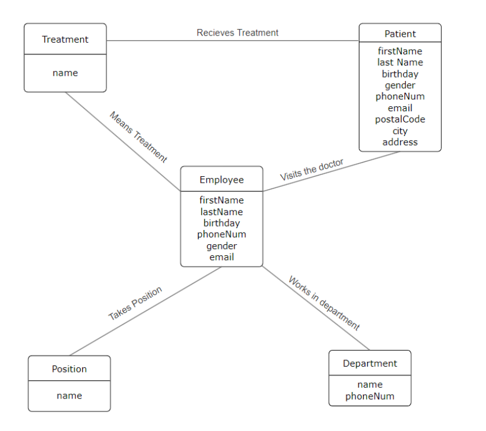
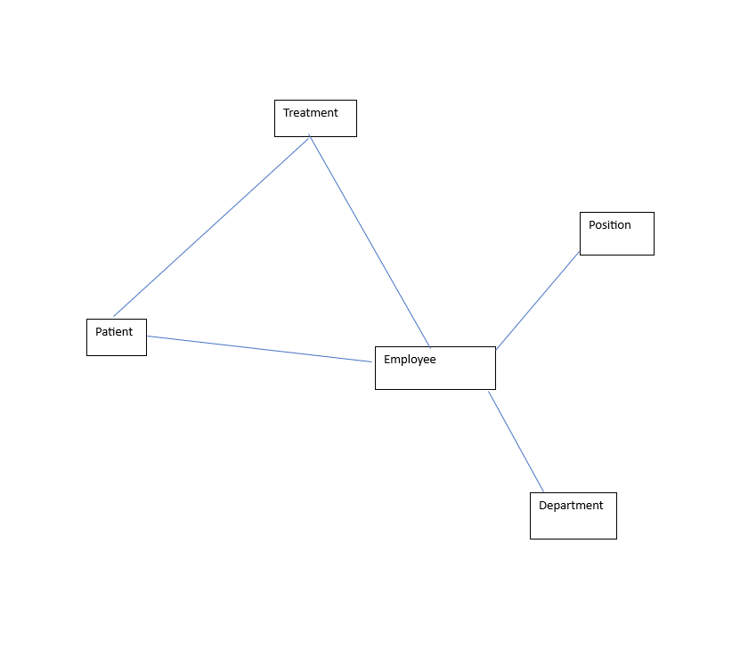
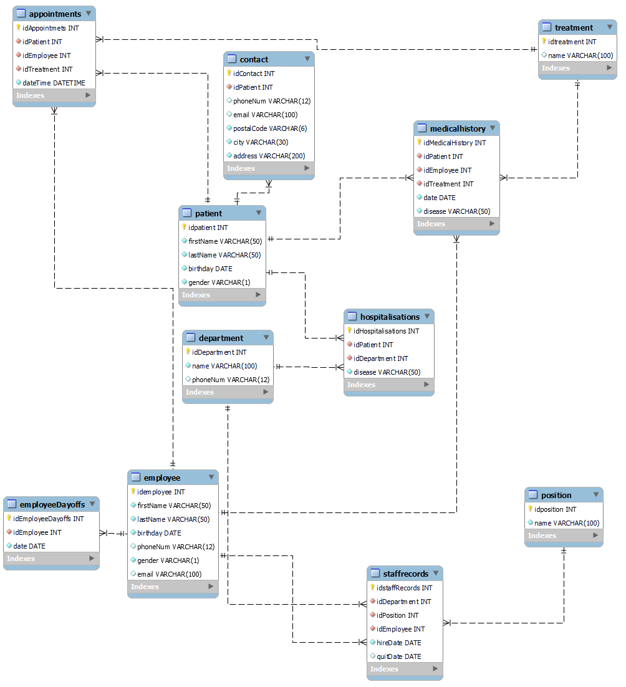

# Hospital_Database

## Task 1

Within my hospital database there will be 11 tables. Appointments, Contact, Department, Employee, EmployeeDaysOffs, Hospitalisations, Medical History, Patient, Position, Staff Records and Treatment.
The Appointments table is designed to store and manage information related to appointments, featuring columns such as idAppointments, idPatient, idEmployee, idTreatment, and dateTime.
The Contact table is structured to store and manage contact information, encompassing columns such as idContact, idPatient, phoneNum, email, postalCode, city, and address.
The Department table is designed to store and manage information related to departments within an organization, featuring columns such as idDepartment, name, and phoneNum.
The Employee table is structured to store and manage employee information, including columns such as idEmployee, firstName, lastName, birthday, phoneNum, gender, and email.
The table for employee days off includes columns for the unique identifier of days off (idEmployeeDaysOffs), the employee's identifier (idEmployee), and the date.
The hospitalizations table contains columns for the unique hospitalization identifier (idHospitalizations), patient identifier (idPatient), department identifier (idDepartment), and the associated disease.
The MedicalHistory table is designed to store and manage records of medical histories, containing columns such as idMedicalHistory, idPatient, idEmployee, idTreatment, date, and disease.
The Patient table is designed to store and manage patients' personal information, including columns such as idPatient, firstName, lastName, birthday and gender.
The Position table is structured to store and manage information related to positions within a system or organization, featuring columns such as idPosition and name.
The StaffRecords table is designed to store and manage comprehensive information about staff members, incorporating columns such as idStaffRecords, idDepartment, idPosition, idEmployee, hireDate, and quitDate.
The Treatment table is structured to store and manage information pertaining to various treatments, encompassing columns such as idTreatment and name.

Entity dictionaries: Department, employee, position, treatment, patient.

The Contact information is stored in a separate directory that is linked through a FK to the Patients table with an N:1 relationship. (Patient's contact information)

Staff Records describe an N:N relationship between departments, positions, and employees. (Who held which position, when, and in which department.)

DaysOff describes a 1:N relationship between employees and non-working dates. (When a doctor was on leave.)

Appointments describe an N:N relationship between doctors (employees), patients, treatment procedures, and specific time dates. (At what time a patient under a specific doctor undergoes treatment procedures.)

Medical History describes an N:N relationship between doctors, patients, treatments, and dates (when a patient, under which doctor, was prescribed treatment and with what diagnosis).

Hospitalizations describe an N:N relationship between patients and departments (where the patient is located).

### UNF
StaffRecords (department_positions, employees)

Appointments ( department_doctors, date, patients)

Hospitalisations ( department, patient, disease)

MedicalHistory (department , doctor, disease, date,  treatment, patient)

### 1NF
StaffRecords (departament, position, employee, birthday, phoneNum, gender, email, hireDate, quitDate)

Appointments (patient , patientPhoneNum, doctor, departament, departamentPhoneNum, treatment, dateTime)

Hospitalisations (department, firstName, lastName, birthday, gender, phoneNum, email, postalCode, city, address,  disease)

MedicalHistory (department , doctor, disease, date,  treatment, patient)

EmployeeDaysOffs ( firstName, lastName, date)

Department (name, phoneNum)

Employee (firstName, lastName, birthday, phoneNum, gender, email)

Patient ( firstName, lastName, birthday, gender)

### 2NF
StaffRecords (idStaffRecords(PK), departament, position, employee, birthday, phoneNum, gender, email, hireDate, quitDate)

Appointments (idAppointments(PK), patient , patientPhoneNum, doctor, departament, departamentPhoneNum, treatment, dateTime)

Hospitalisations (idHospitalisations(PK), department, firstName, lastName, birthday, gender, phoneNum, email, postalCode, city, address,  disease)

MedicalHistory (idMedicalHistory(PK), department , doctor, disease, date,  treatment, patient)

EmployeeDaysOffs (idEmployeeDayOffs(PK),  firstName, lastName, date)

Department ( idDepartment(PK), name, phoneNum)

Employee ( idEmployee(PK), firstName, lastName, birthday, phoneNum, gender, email)

Patient ( idPatient(PK), firstName, lastName, birthday, gender)

### 3NF
Department ( idDepartment(PK), name, phoneNum)

Employee ( idEmployee(PK), firstName, lastName, birthday, phoneNum, gender, email)
Position ( idPosition(PK), name)

StaffRecords (idStaffRecords(PK), idDepartment(FK), idPosition(FK), idEmployee(FK), hireDate, quitDate)

EmployeeDaysOffs ( idEmployeeDayOffs(PK), idEmployee(FK), date)

Treatment ( idTreatment(PK), name)

Patient ( idPatient(PK), firstName, lastName, birthday, gender)

Contact (idContact(PK), idPatient(FK), phoneNum, email, postalCode, city, address)

Appointments ( idAppointments(PK), idPatient(FK), idEmployee(FK), idTreatment(FK),dateTime)

Hospitalisations ( idHospitalisations(PK), idPatient(FK), idDepartment(FK), disease)

MedicalHistory ( idMedicalHistory(PK), idPatient(FK), idEmployee(FK), idTreatment(FK), date, disease)

